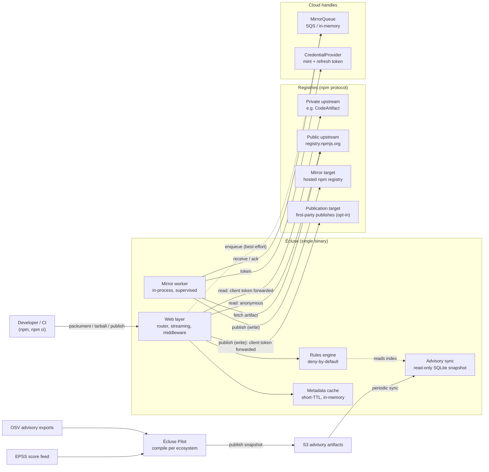
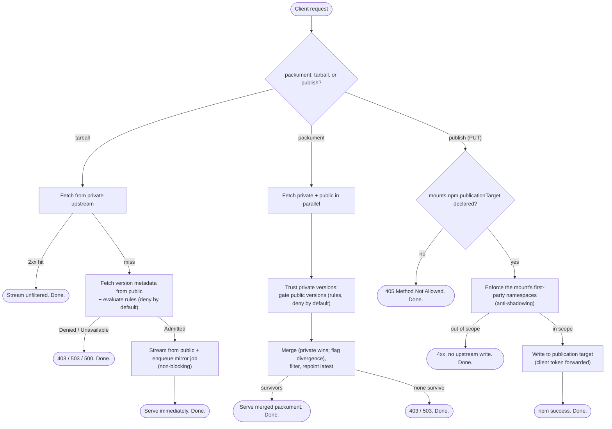

# Architecture and requirements

Index to Écluse's systems design: what it is, how a request flows, and what is out of
scope. Each concern's detailed design lives under [`architecture/`](architecture/).
Development practices, layout, testing, and CI are in
[`../CONTRIBUTING.md`](../CONTRIBUTING.md). The _why_ is in
[`../MOTIVATION.md`](../MOTIVATION.md). This document and its links are the _how_.

Écluse is a supply-chain policy proxy for package registries. It sits between the client
(a developer or CI) and the upstream registry, and applies a deny-by-default policy before
any package reaches a build. It hosts no packages itself. The name is French for a canal
lock: the controlled passage every dependency clears before a build. The goal is
resilience, limiting the blast radius of a bad publish, not malware detection.

Écluse delegates storage to the store each mount declares. It enforces policy on public reads
and mirroring. npm supports reads, mirroring, and first-party publication. PyPI supports reads
only. The following diagrams show a mirrored npm deployment.

## The stack at a glance

Écluse is Haskell (GHC 9.10), built and pinned through Nix flakes, with `ecluse.cabal` and
`flake.lock` as the dependency authority. Cloud integration is AWS (`amazonka`), and
observability is opt-in OpenTelemetry over OTLP.

## System overview

A single Écluse binary runs the HTTP server and an in-process mirror worker over a shared,
handle-based `Env`. The data plane (metadata and artifact bytes) is `http-client`. The control
plane (queue, token mint, store maintenance) sits behind the [three backend
handles](architecture/cloud-backends.md#cloud-backends), one on the platform axis and two on a
mount's store. The diagram draws the proxy process, which builds the queue and the mint. The
store-maintenance handle belongs to `ecluse dredger`. Solid edges are synchronous request-path
work. Dotted edges are best-effort or asynchronous.

## Request lifecycle

The three request shapes use the upstreams differently: a tarball _falls back_, a
packument _merges_, and a publish _writes through_.

- **Tarball**: a private hit streams unfiltered. A private miss gates the version on its
  public metadata, and a denial follows the [error model](architecture/web-layer.md#error-model).
  Mirroring is demand-driven, so Écluse mirrors only the versions a client pulls.
- **Packument**: the merge keeps not-yet-mirrored public versions visible, so demand-driven
  mirroring can fire. A first-party name skips the public leg entirely and answers `404` on a
  private miss. See
  [Packument merge](architecture/registry-model.md#packument-merge-across-upstreams).
- **Publish**: Écluse checks the name against the mount's first-party namespaces before any
  upstream write (anti-shadowing). The path is opt-in: a `PUT` is `405` when
  `mounts.npm.publicationTarget` is undeclared. See
  [Publishing first-party packages](architecture/registry-model.md#publishing-first-party-packages-the-publication-target).

## Document map

| Document | Covers |
| --- | --- |
| [Registry model](architecture/registry-model.md) | The four registry roles (two reads, two writes), the domain vocabulary, and the registry abstraction. |
| [Web layer](architecture/web-layer.md) | Raw-WAI front door: routing, mounts, the OpenAPI spec, the control/data-plane split, streaming, and graceful shutdown. |
| [Rules engine and responses](architecture/rules-engine.md) | Deny-by-default evaluation, the rule tiers, the CVE subsystem, and denial responses. |
| [Cloud backends and mirroring](architecture/cloud-backends.md) | The mirror queue, the platform and store axes, the two store kinds, and the three handles (`MirrorQueue`, `CredentialProvider`, `StoreMaintenance`). |
| [Configuration and authentication](architecture/configuration.md) | Environment config, outbound registry credentials, and inbound client auth. |
| [Security posture](architecture/security.md) | The trust assumptions the threat model rests on, the credential posture, and the two floors that fail closed. |
| [Threat model](https://ecluse-proxy.com/docs/threat-model/) | The STRIDE register, generated from the Threat Dragon model (`threat-modelling/ecluse.json`). The single source of truth for the system's threats. |
| [Observability](architecture/observability.md) | Opt-in OpenTelemetry/OTLP tracing and metrics, with Datadog optional. |
| [Release and supply-chain operations](architecture/release-supply-chain.md) | The reproducible OCI image, the publish/attest chain (provenance + SBOM), and CVE and freshness scanning. |

## Current limits

- Package hosting or storage (delegated to the registries).
- Filesystem and S3 package backends are planned but not implemented. Mirror writes currently
  use registry protocols. The S3 advisory-artifact store is a separate capability.
- Web UI or admin API.
- Re-specifying upstream registry protocols in the
  [OpenAPI spec](architecture/web-layer.md#openapi-spec): Écluse documents its coverage, not npm's
  full contract, which clients hardcode.
- PyPI mirroring and publication are not implemented. PyPI metadata and distribution-file reads
  ship alongside npm (see [Multi-ecosystem mounts](architecture/web-layer.md#multi-ecosystem-mounts)).
- Cloud IAM validation at the proxy edge (a gateway concern).
- Local on-disk caching of artifacts (the mirror retry window is acceptable).
- GCP backends (see [Cloud backends](architecture/cloud-backends.md#cloud-backends)).
