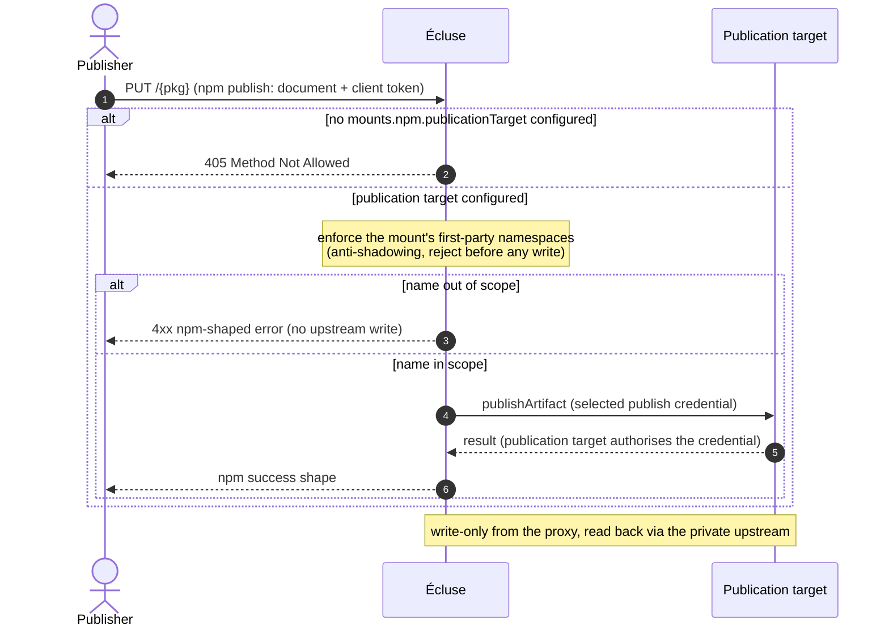
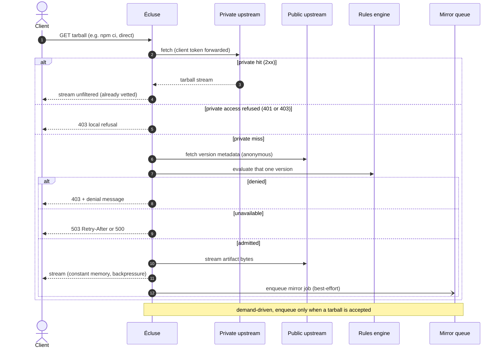
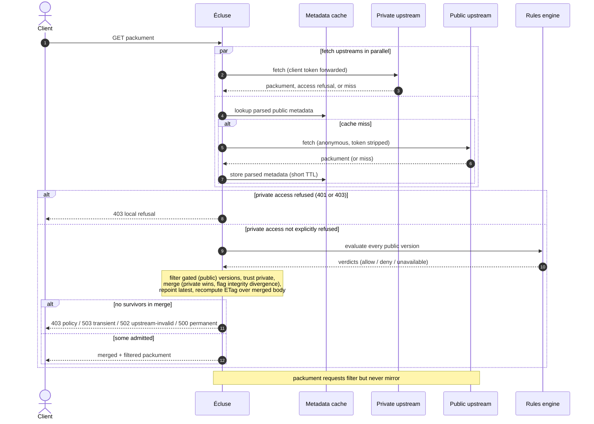

# Registry model

> Part of the [Écluse architecture overview](../architecture.md).

How Écluse uses the registries around it: the four roles a mount can point at, and how each
request shape draws on them. It also covers the domain model above the wire and the adapter
boundary a new ecosystem plugs into.

## Registry roles

A mount carries up to four registry roles, two reads and two writes, each set independently.
Several may map to one physical registry. The recommended topology keeps the first-party store
and the public-derived store separate, and unions them at the registry level (see
[Registry-level composition](#registry-level-composition-the-recommended-topology)). A single
shared registry is the degenerate floor.

| Role | Purpose |
|------|---------|
| **Private upstream** | The authoritative, already-vetted source, read as trusted. A tarball is a conventional stable read at `{base}/{pkg}/-/{file}`. Écluse trusts a packument's versions and merges them with the gated public set. Optional on a serve-only mount. |
| **Public upstream** | The source of versions not yet in the private upstream. The rules gate everything here. It is the tarball fallback on a private miss, and Écluse fetches it alongside the private upstream for a packument. The only required role: a pure public gate serves from it alone. |
| **Mirror target** | Where the worker writes approved public packages once they pass the rules. Declaring one is what makes a mount mirror. Best a distinct store unioned into the private read path. |
| **Publication target** | Where Écluse writes client-published first-party packages (`npm publish`). Distinct from the mirror target: client-driven first-party content, not proxy-driven approved-public content. See [Publishing first-party packages](#publishing-first-party-packages-the-publication-target). |

Whether a mount mirrors is **derived from its endpoints, never declared as a mode**. A declared
`mirrorTarget` makes the mount mirror, and the mount then requires a private upstream so a client
can read the mirror back. Without one, boot fails with `MountMissingPrivateUpstream`. An absent
`mirrorTarget` makes the mount serve-only: no writes, and the private upstream optional. A mount
with neither is the pure public gate. A serve-only mount runs the full rules gate unchanged. The
trade is that every artifact stays on the gated public leg instead of retiring onto the private
read (see [the V](#registry-level-composition-the-recommended-topology)).

### Credential flow and authority

Reads use **passthrough**: Écluse forwards the caller's own credential to the private upstream and
reads the public upstream anonymously.

- **Private upstream (read)**: Écluse forwards the client's credential and the upstream authorises
  each request. Per request, never cached across clients. A credential is a **pair**: a secret and
  the username half a scheme such as HTTP Basic carries beside it. The pair travels verbatim,
  because a private registry has username conventions of its own and rewriting one would
  authenticate as somebody else. The edge gate compares the secret half alone, so one configured
  edge token serves every ecosystem's presentation.
- **Public upstream (read/fallback)**: queried anonymously. Any auth a public mirror needs is
  Écluse's own, not the client's.
- **Mirror target (write)**: always Écluse's own
  [`CredentialProvider`](cloud-backends.md#the-credential-mint) token, from the tag the target
  declares. The `codeArtifact` tag mints per its domain, and the other tags carry a static write
  token (see [Configuration](configuration.md#outbound-registry-credentials)). Declare it
  under its own key even when it equals the private upstream: the client reads it, Écluse writes
  it.
- **Publication target (write)**: follows the configured
  [publish credential mode](https://ecluse-proxy.com/docs/deployment/#edge-authentication-and-client-credentials). Écluse mints no token.

The non-negotiable invariant, under every strategy: **the client's credential is never sent to
the public upstream.** The boot enforces it on the one client-driven write: a `publicationTarget`
on any mount's `publicUpstream` host, or equal to another mount's endpoint, refuses to start.

The private upstream is the per-client authority for who may read what. The proxy reads its
metadata per request and **never enters it into the shared cache**. A credential-blind key would
let one client warm an entry that a differently-authorised client then gets as a hit. That is the
cross-client disclosure hazard in the
[threat model](https://ecluse-proxy.com/docs/threat-model/). The cache holds only the anonymous
public origin (see the [metadata cache](web-layer.md#metadata-cache)).
The [security invariants](security.md) bound outbound requests further: the host allowlist,
internal-range blocking, canonicalisation, and response bounds.

Separate Écluse instances per tenant are a blast-radius or policy-isolation choice. They are not
a substitute for the credential model, and they scale to team granularity, never per-developer.

## Publishing first-party packages (the publication target)

The publication target adds the one client-driven write path. Écluse accepts a `PUT /{pkg}`
(`npm publish`) at the mount and relays it to the publication target. That write is distinct in
trigger, content, and credential from the mirror write.

- **Anti-shadowing guard (the load-bearing control).** Écluse refuses a publish whose name falls
  outside the mount's `firstParty` namespaces (for npm, scopes such as `@acme`). That stops a client
  publishing a name that shadows an existing public package, a dependency-confusion vector. The
  guard holds a **guard-name ≡ URL-path name ≡ every declared body name** invariant. The scope
  check keys on the URL-path name. An npm publish document declares its own identity (`_id`,
  top-level `name`, every `versions[].name`), so the guard validates those names too. Any present
  declared name that disagrees is a `403` before any relay, under the same `PackageName` equality
  the route uses. An absent name is no claim. The guard reads names only and never decodes the
  base64 `_attachments`.
- **Credential.** See [Credential flow and authority](#credential-flow-and-authority).
- **No read-back role.** Write-only from the proxy's view. Published packages read back through
  the private upstream. So the operator points the publication target at the same registry as the
  private upstream, or aggregates it into that read path.
- **Opt-in.** The path exists only when `mounts.npm.publicationTarget` is declared. Otherwise
  a `PUT /{pkg}` is `405 Method Not Allowed`.

## Where an artifact lives

npm serves a package's bytes from the registry host that served its listing. PyPI does not: a
Simple index names each file's own location, and public PyPI puts those on
`files.pythonhosted.org` rather than on `pypi.org`. A client that resolved metadata through
Écluse and then pulled the bytes from that host directly would be past the gate, so a mount
rewrites every served location back under its own prefix.

Which locations Écluse will fetch from is not the operator's to widen. An ecosystem declares the
hosts it serves artifact bytes from by design, and a mount honours a file only on the authority
that served its listing or on one of those declared hosts. A file anywhere else is **dropped
from the served listing**, not listed and refused at download, so a client never resolves
against a file it could not have installed. A release disappears when no file of it survives.
The same check runs at the download gate from the same definition, so the listing and the gate
cannot disagree.

For npm this is visible: a packument naming a tarball on a foreign host used to serve the
rewritten URL and refuse when the client asked for the bytes. That version now does not appear.

## Serving a tarball

A tarball is one concrete version from one source, so the proxy streams a private-upstream hit
straight through. The two legs locate the bytes differently, by the trust of their origin.

The **private leg is a conventional stable read**. It fetches the tarball at
`{private-base}/{pkg}/-/{file}` by the client's requested filename, the URL an `npm ci` issues,
and never fetches the private packument first. A lockfile fan-out then pays one artifact
round-trip instead of a per-tarball packument fetch it would discard. The proxy forwards the
client's credential and disables redirect-following, so the leg never follows a `3xx`
([Security posture](security.md#trust-assumptions--credential-posture)).
A `2xx` streams and a conditional `304` passes through. An explicit private `401` or `403`
refuses the read, because public bytes can differ from a private patch under the same identity.
Other unsuccessful statuses retain the private-miss policy. The leg applies **no
serve-time integrity floor**: it fast-tracks a lockfile-pinned version from a trusted registry.
The client and the mirror worker still verify those bytes, so the leg gives up the proactive
refuse-weak-integrity stance, not tamper-evidence. The packument route's listing-side trusted
floor ([Integrity floors](security.md#integrity-floors)) stays in force. A private upstream that serves
tarballs off-convention (a separate files host, or a presigned CDN URL the `/-/` path cannot
rebuild) becomes a private miss.

The **public leg** honours the `dist.tarball` the gated version declares and fetches exactly that
URL, not a reconstructed `/-/` path. The proxy can then front a registry that serves bytes from a
separate host (the PyPI-files-host shape) or from a signed CDN URL. The ecosystem's adapter
declares such hosts and the same-host gate admits them, with no operator knob to widen the
surface. The proxy never trusts that location. The allowlist and the same-host gate bound where
it may fetch the bytes, and https-only egress with certificate validation authenticates the host.
The proxy upgrades a legacy `http` tarball on the same host, or drops it (see
[Securing network egress](https://ecluse-proxy.com/docs/deployment/#network-egress)).

On a private miss the proxy gates that one version, streams from public, and enqueues a
demand-driven mirror job. The enqueue does not block, so the proxy serves the client immediately.
See [Streaming](web-layer.md#streaming-and-resource-lifetime) and
[Mirror queue](cloud-backends.md#mirror-queue).

## Packument merge across upstreams

A packument is the set of available versions, spread across upstreams. The private upstream holds
what has already been vetted, plus what the worker has mirrored. The public upstream holds the
full history, including the versions not yet mirrored. Serving only the private packument would
hide the new versions, so a client never requests them and demand-driven mirroring never fires
(see [Mirror queue](cloud-backends.md#mirror-queue)). The proxy therefore merges the packument
above the [protocol boundary](#registry-abstraction), as a pure, ecosystem-agnostic fold over
`PackageInfo` that a new ecosystem does not rewrite. The merge is **order-independent**: private
wins a collision and the merge flags divergence whatever the fetch order. Only positional labels
track which input a survivor came from, so the serve layer can index back to the raw document.

- **Fetch in parallel.** Private (passthrough) and public (anonymous) concurrently. A name inside
  the mount's `firstParty` namespaces is the exception: it has one authority, so Écluse fetches the
  private origin alone and a miss there is a `404`. A public package registered under a name the
  deployment owns is a dependency-confusion attack, and refusing the public leg is what keeps one
  verdict on a name wherever the privilege is read. The mirror worker reads that same predicate, so
  a job enqueued before the declaration drops before any public request rather than mirroring public
  content under an owned name.
- **Trust split by provenance.** Private versions enter unfiltered. The rules engine gates public
  versions first (see [Applying verdicts](rules-engine.md#applying-verdicts-to-a-packument)). The
  result is `trusted(private) ∪ filtered(public)`.
- **Collision: private wins, divergence is a signal.** On a shared version key the private copy
  wins. The public copy may contradict it on a shared artifact's shared integrity algorithm: same
  file, same algorithm, disagreeing digests. That is the supply-chain tampering Écluse exists to
  catch. The merge detects it, logs it (a `WARNING` naming the package, the versions, and the
  digests), meters it (`ecluse.registry.merge.divergence`), and never reconciles it silently.
  `ECLUSE_INTEGRITY__DIVERGENCE_POLICY` decides the rest. `warn` (the default) serves the trusted
  copy and relies on the alarm. `fail-closed` drops the contested version and any `dist-tag`
  pointing at it. One upstream carrying a digest the other omits is not a divergence.
- **Below-floor versions are inadmissible.** A version whose strongest digest is too weak or absent
  is a divergence blind spot, refused before the merge. The listing drops it, and the public
  artifact path `403`s it as `MissingIntegrity` or `BelowIntegrityFloor`. The private tarball leg
  is the exception: the client and the worker verify its bytes. The floors are
  `ECLUSE_INTEGRITY__MIN_PUBLIC` (hard-floored at SHA-256) and `ECLUSE_INTEGRITY__MIN_TRUSTED`
  (loosenable, refinable per mount: see
  [`config/default.yaml`](../../config/default.yaml)). This is
  [Integrity floors](security.md#integrity-floors).
- **Reconcile over the union.** `dist-tags.latest` follows the
  [keep-unless-denied, stable-preferring rule](rules-engine.md#applying-verdicts-to-a-packument):
  kept when it survives, else repointed to the highest stable survivor. The merge drops other tags
  at an absent version, and restricts `time` to the surviving versions while keeping `created` and
  `modified`.
- **Private access authority.** An explicit private `401` or `403` refuses the request even when
  public metadata succeeds. The refusal precedes merge and conditional response selection.
  See the [operator policy](../../web/content/docs/configuration.md#first-party-namespaces).
- **Partial availability.** For other failures, if one upstream fails while another succeeds, the merge serves the
  best-effort union with a degraded signal (readiness stays
  [lenient about public reachability](web-layer.md#meta-routes-ping-health-and-search)). Only when
  nothing resolves does the request error.

A packument request filters but never mirrors. See
[Applying verdicts to a packument](rules-engine.md#applying-verdicts-to-a-packument).

### The route name is the served name's validation authority

The proxy knows the requested name from the route, so an upstream's self-reported top-level `name`
is a cross-check, never the served authority. The served `name` is always a value an upstream
genuinely reported, and validation guarantees it equals the route name. An origin whose
`name` agrees merges normally. The proxy treats an origin whose `name` disagrees as untrusted for
this request: it drops the origin and logs the drop. An absent or undecodable name is instead an
undecodable-packument degrade. A single misreporting upstream drops out while any other valid
origin still serves `200`. The request is `502 Bad Gateway` (`PackumentBadGateway`, see
[Error model](web-layer.md#error-model)) only when no origin yields a valid packument *because the
responding origins mismatched*. That is distinct from a genuine absence. This forecloses
cache-poisoning: a misreporting upstream cannot shadow a real package or win the union with a
divergent `name`.

### Decision surface vs served surface

The merge decides over the typed `PackageInfo` but serves the raw upstream document, rebuilt from
the winning sources. The rebuild takes only the surviving versions, rewrites their tarball URLs,
carries `latest` from the plan, and relays every unmodeled key unchanged. The proxy never
re-serialises the body from the lossy typed model, which is why the API surface
[owns that schema](web-layer.md#the-synthesised-packument-schema--the-trust-boundary).

### Graceful degradation: per-version, not per-package

Decoding into the decision surface is lenient at version granularity, with a fail-closed boundary.
An undecodable `dist.unpackedSize` reads as absent and the version survives. `fileCount` and
`signatures` have no reader at all: nothing decides on them, and they relay unmodelled with the
rest of the body. The decoder drops a version broken in a required field (no `dist` or `tarball`,
an unusable `version`) rather than serve it unverifiable. Its healthy siblings keep serving. Only
an unusable top-level document (not an object, absent `name`, non-object `versions`) denies the
package wholesale. The decoder tracks dropped entries as `InvalidEntry`
([`Package.hs`](../../core/src/Ecluse/Core/Package.hs)), so the drop is observable. This turns
"one poisoned version denies the whole package" into a per-version drop.

### Registry-level composition (the recommended topology)

The recommended deployment keeps the first-party store and the public-derived mirror store
physically separate. It unions them at the registry level into the private-upstream read path.
One example is an AWS CodeArtifact repository drawing from a mirror-target repo and a first-party
repo. The private upstream then returns the full trusted set in one fetch, while each store stays
independently governable (distinct scanning per provenance, clean post-disclosure scoping).
Collapsing the roles onto one store works as the degenerate floor: it trades away auditability and
defence-in-depth, not the perimeter.

The topology is a **V**: Écluse fans a read to the public origin and to the private pull-through,
which unions the mirror and first-party stores. The worker back-fills every admitted public
tarball into the mirror, and the mirror feeds the private read path. The private read therefore
comes to serve nearly all tarball traffic once a fleet has warmed. The public tarball leg is a
transient, per-artifact fail-over that a new version transits until the worker promotes it. Its
throughput matters for onboarding, not for steady-state capacity. Trading private-hit (hot-path)
work to speed the public fail-over is a regression. A **serve-only** mount opts out of the
back-fill, so its public leg is permanent. It is the low-effort shape, and the accepted trade is
slower installs at scale and egress that never retires. Availability also couples to the public
registry, and no mirrored copy survives an upstream yank. The security gate is identical.
Declaring a `mirrorTarget` later upgrades the mount in place.

#### The one rule of registry composition: Écluse is the only path from public

Écluse applies ingestion-time policy (freshness gating, integrity floors, the rule algebra) that
managed registries do not. That value holds only if public packages enter through Écluse and
nowhere else. So the aggregating read endpoint, the private upstream, must union trusted stores
only: your first-party publications and Écluse's sanitised mirror. It must not carry a direct
upstream connection to the public registry. Such a connection would let raw, ungated public
packages reach clients behind the gate rather than through it, and silently nullify the
protection. The proxy cannot detect this from the outside, because it trusts the private upstream
by construction. Keeping the internal registry disconnected from public is therefore an
operator-architecture invariant, catalogued in the
[threat model](https://ecluse-proxy.com/docs/threat-model/).

## The internal domain model

`PackageDetails` ([`core/src/Ecluse/Core/Package.hs`](../../core/src/Ecluse/Core/Package.hs))
is the ecosystem-agnostic per-version snapshot every adapter produces and the rules engine
consumes. Its shape follows the npm protocol. Two principles govern it:

- **The rules engine is ecosystem-blind.** It never branches on npm vs PyPI vs RubyGems.
  Adapters project each wire format into normalised signals: a rule sees `CodeExecSignal`,
  `Trust`, `Availability`, never `hasInstallScript`, `packagetype`, or `extensions`.
- **Signal availability is explicit.** A signal the adapter has not determined, or cannot
  determine cheaply, has its own representation (`CodeExecUnknown`, `TrustUnknown`, `Nothing`).
  A pure rule then yields no decision rather than guessing, and an effectful rule can resolve it
  later.

### The shared vocabulary

| Concern | Representation | Why |
|---|---|---|
| **Identity** | `PackageName`: an ecosystem tag, an optional namespace (npm scope), a normalised `canonical` key, and a `display` form. Equality and ordering use `(ecosystem, namespace, canonical)` only, never the display or base forms. | npm is case-sensitive with scopes, PyPI normalises (PEP 503), RubyGems is verbatim. `Flask` and `flask` are one PyPI package but two npm ones, so the ecosystem tag is part of identity. Matching uses the canonical key while rendering stays faithful. |
| **Version** | In [`Ecluse.Core.Version`](../../core/src/Ecluse/Core/Version.hs): opaque, holding the raw text plus a `Maybe VersionKey` parsed at construction. `parseVersionKey :: Ecosystem -> Text -> Either VersionError VersionKey` is the only way to a key, and `compareVersions` works only on keys, so non-canonical text never reaches the comparator. Unparseable means no key, so ordering rules abstain and the proxy still serves the version. `Version` carries no derived `Ord`. | Lexicographic ordering is wrong for every grammar (`"10.0.0" < "9.0.0"`), and the proxy must keep serving a version even when the parser can't order it. |
| **Install-time code execution** | `CodeExecSignal = NoCodeOnInstall \| RunsCodeOnInstall reason \| CodeExecUnknown`. | Unifies npm install scripts, PyPI sdist builds, and RubyGems native extensions. `Unknown` carries the gemspec-fetch case. |
| **Trust / provenance** | `Trust = Trusted (NonEmpty TrustEvidence) \| Untrusted \| TrustUnknown`. `TrustEvidence = Signed \| Attested \| MfaPublished \| OtherEvidence text`. | Signing, attestation, and MFA differ per ecosystem but reduce to one signal. The evidence captures the how without the ecosystem. |
| **Availability** | `Availability = Available \| Deprecated msg \| Yanked (Maybe reason)`, plus a per-artifact `artYanked`. | npm deprecates and RubyGems yanks whole versions. PyPI yanks individual files, so the per-file flag keeps "listed-but-yanked" and lets exact pins resolve. |
| **Artifacts** | A version owns `NonEmpty Artifact`. Each carries algorithm-tagged `Hash`es, kind/platform, size, interpreter constraint, and a provenance URL. | npm has one tarball, PyPI an sdist plus many wheels, and RubyGems one gem per platform. |
| **Dependencies** | Deliberately not modelled, nor parsed off the wire. | A dependency matters only when a client fetches it, and that fetch returns through this gate for its own verdict, so gating a parent's dependency list would duplicate the gate on every child. The raw document still relays the lists untouched. If a dependency-reading rule is ever designed, restore the `Dependency` / `DepKind` vocabulary from history. |

The types live in [`Ecluse.Core.Package`](../../core/src/Ecluse/Core/Package.hs),
[`Ecluse.Core.Version`](../../core/src/Ecluse/Core/Version.hs), and
[`Ecluse.Core.Ecosystem`](../../core/src/Ecluse/Core/Ecosystem.hs).

A served packument is the merge of several upstreams' `PackageInfo`. See
[Registry model → Packument merge](registry-model.md#packument-merge-across-upstreams) for
how trusted and gated provenances combine.

## Registry abstraction

The proxy core is registry-agnostic. A mount is where two axes meet: its ecosystem contributes the
protocol adapter, and its store contributes the backend the mount's private packages live in.
[Cloud backends](cloud-backends.md#cloud-backends) covers the two store kinds and what each one
supplies.

The two sides share only the vocabulary above: `Ecosystem`, `PackageName`, and `Version`. Neither
imports the other, and a store that needs an ecosystem fact reads it off the `Ecosystem` value, as
the CodeArtifact format token does. A backend matrix therefore costs one adapter per ecosystem plus
one backend per store, never a cell per pair. npm is the only ecosystem this build carries, and its
stores are CodeArtifact, any host that speaks the protocol, and Verdaccio for development.
